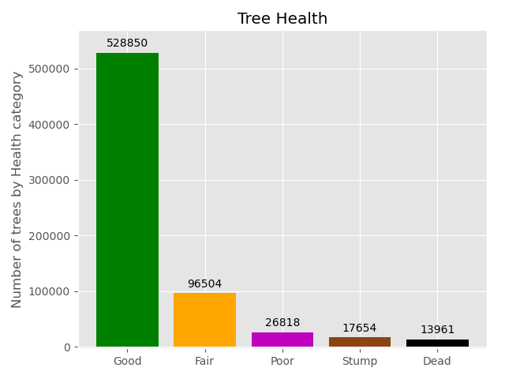
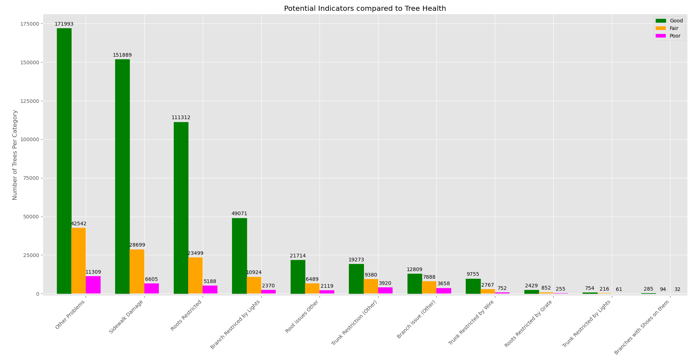

# NYC Tree Census Data Analysis
## Table of Contents
1. [Background](Background)
2. [Data](Data)
3. [Third Example](#third-example)
4. [Fourth Example](#fourth-examplehttpwwwfourthexamplecom)

## Third Example
## [Fourth Example](http://www.fourthexample.com) 
## Goal
To determine if factors recorded in the 2015 NYC tree cencus correspond to tree health.

# Background
NYC began taking in Tree cencus information in 2005 and has since repeated the cencus every five years. The project has been undertaken laregly to address issues as they come with little analysis. The NYC tree cencus website does have some minor mapping of trees and such but not in relation to tree health or any of their recorded factors. Factors recorded in this study were merely recorded to address issues as they came about and not for any statistical analysis to be used in the program. Reading through through the [Tree Census](http://media.nycgovparks.org/images/web/TreesCount/Index.html#portfolio) information was very helpful in determining how to interpret this data but also some meaningful insight into the community behind this data. NYC it seems is very committed to improving the health and number of their trees over time. The level of commitment from the volunteers was astounding. The top five individual volunteers mapped 35,995 trees on their own which represents 5.4% of all the data.

# Data
## Description
Reading through the manual LINK TO MANUAL data was collected and verified with great attention to detail. Not only was the dataset meticulously organized but they also corrected user error as it was collected. Using, among other tactics, google earth aerial images and street view they were able to either correct an error or have someone sent to recollect the data. Data that was recorded included Geographical data, User data, species data, health assesment by tree, and markers we will refer to as indicators of tree health. The 2015 csv included 683,787 rows representing individual trees in NYC. Each row had 40 columns of which most were unique. Some collumns like Latin name and Common name were effectively colinear.

## Data Cleaning
I created a function that would scan the dataset for NaN values and return the column and number of NaN values in that column. Another returned a set of indexes where these data points existed in the dataframe. After isolating variables and runnning several more tests I determined that 31619 trees contained NaN values in exactly the same columns. These trees shared either a "Dead" (Dead standing tree) or "Stump" value in the "Status" column. Because a tree could be cut down for any number of reasons separate from its health "Stump" categories were not considered in this analysis. Dead trees shared missing values along consisten columns but as tree death is a factor of enviroment it may provide use in analysis such as geographical analysis and therefore was reflected in several graphs. a bit of the "cleaning" occured throughout the code as it made more sense to keep variables in a usable format and then convert them to a viewer friendly format when present the data in charts and graphs.  

## Data selection
Because most data analysis occured on indicators of tree health these data points recieved the most attention. Columns were grouped by the type of data they provided. The majority of the data points were binary, either an issue was or was not recorded. Others however were categorical "curb_loc"  among other categories was graphed and analyzed separately. Data columns were chosen because they had clear meaning that would logically have an impact on tree health. Some collumns such as Zipcode were excluded due to their large size of individual values. This data would be excellent for follow up analysis.
* Demographic Characteristics:

        'tree_id', 'block_id', 'created_at', 'tree_dbh', 'stump_diam', 'curb_loc', 'status', 'health', 'spc_latin', 'spc_common', 'steward', 'guards', 'sidewalk', 'user_type', 'problems', 'root_stone', 'root_grate', 'root_other', 'trunk_wire', 'trnk_light', 'trnk_other', 'brch_light', 'brch_shoe', 'brch_other', 'address', 'zipcode', 'zip_city', 'cb_num', 'borocode', 'boroname', 'cncldist', 'st_assem', 'st_senate', 'nta', 'nta_name', 'boro_ct', 'state', 'latitude', 'longitude', 'x_sp', 'y_sp'
* Binary Inidcators:
        'root_stone', 'root_grate', 'root_other', 'trunk_wire', 'trnk_light', 'trnk_other','brch_light', 'brch_shoe', 'brch_other', 'sidewalk', 'problems'
* Categorical Indicators:
        'curb_loc', 'steward', 'user_type', 'boroname'
* Dependent Variable:
        'health'
# Exploratory Data Analysis
    

    
    

    

    
    

## Features to analyze

## Binary Indicators   
Chart of health vs indicator
What do we learn from this?
## Categorical Indicators
Graphs of Cat vs indicator
talk about each category specifically
