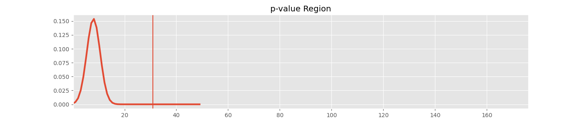

# NYC Tree Census Data Analysis
## Table of Contents
1. [Background](Background)
2. [Data](Data)
3. [EDA](Exploratory_Data_)
4. [Binary](Binary_Indicators)
5. [Conclusion](Conclusion)

## Third Example
## [Fourth Example](http://www.fourthexample.com) 
## Goal
To determine if factors recorded in the 2015 NYC tree census correspond to tree health.

# Background
NYC began taking in Tree census information in 2005 and has since repeated the census every five years. The project has been undertaken largely to address issues as they come with little analysis. The NYC tree census website does have some minor mapping of trees and such but not in relation to tree health or any of their recorded factors. Factors recorded in this study were merely recorded to address issues as they came about and not for any statistical analysis to be used in the program. Reading through through the [Tree Census](http://media.nycgovparks.org/images/web/TreesCount/Index.html#portfolio) information was very helpful in determining how to interpret this data but also some meaningful insight into the community behind this data. NYC it seems is very committed to improving the health and number of their trees over time. The level of commitment from the volunteers was astounding. The top five individual volunteers mapped 35,995 trees on their own which represents 5.4% of all the data.

# Data
## Description
Reading through the [manual](https://www.nycgovparks.org/pagefiles/116/trees-count-2015-training__592dcbad8488f.pdf)  data was collected and verified with great attention to detail. Not only was the dataset meticulously organized but they also corrected user error as it was collected. Using, among other tactics, google earth aerial images and street view they were able to either correct an error or have someone sent to recollect the data. Data that was recorded included Geographical data, User data, species data, health assessment by tree, and markers we will refer to as indicators of tree health. The 2015 csv included 683,788 rows representing individual trees in NYC. Each row had 40 columns of which most were unique. Some columns like Latin name and Common name were effectively collinear.

## Data Cleaning
I created a function that would scan the dataset for NaN values and return the column and number of NaN values in that column. Another returned a set of indexes where these data points existed in the dataframe. After isolating variables and running several more tests I determined that 31619 trees contained NaN values in exactly the same columns. These trees shared either a "Dead" (Dead standing tree) or "Stump" value in the "Status" column. Because a tree could be cut down for any number of reasons separate from its health "Stump" categories were not considered in this analysis. Dead trees shared missing values along consisten columns but as tree death is a factor of environment it may provide use in analysis such as geographical analysis and therefore was reflected in several graphs. Only one row from the entire dataset was deemed unusable as it had no health status this row was dropped. A bit of the "cleaning" occurred throughout the code as it made more sense to keep variables in a usable format and then convert them to a viewer friendly format when presenting the data in charts and graphs. 

## Data selection
Because most data analysis occurred on indicators of tree health these data points received the most attention. Columns were grouped by the type of data they provided. The majority of the data points were binary, either an issue was or was not recorded. Others however were categorical "curb_loc"  among other categories was graphed and analyzed separately. Data columns were chosen because they had clear meaning that would logically have an impact on tree health. Some columns such as Zipcode were excluded due to their large size of individual values. This data would be excellent for follow up analysis.

* Complete column list:  Multiple data analysis projects could be run using the plethora of data this census returned.

        'tree_id', 'block_id', 'created_at', 'tree_dbh', 'stump_diam', 'curb_loc', 'status', 'health', 'spc_latin', 'spc_common', 'steward', 'guards', 'sidewalk', 'user_type', 'problems', 'root_stone', 'root_grate', 'root_other', 'trunk_wire', 'trnk_light', 'trnk_other', 'brch_light', 'brch_shoe', 'brch_other', 'address', 'zipcode', 'zip_city', 'cb_num', 'borocode', 'boroname', 'cncldist', 'st_assem', 'st_senate', 'nta', 'nta_name', 'boro_ct', 'state', 'latitude', 'longitude', 'x_sp', 'y_sp'

* Binary Inidcators:    This data contained simple "Yes" "No" responses. "Yes" represented the presence of something harmful to the tree.

        'root_stone', 'root_grate', 'root_other', 'trunk_wire', 'trnk_light', 'trnk_other','brch_light', 'brch_shoe', 'brch_other', 'sidewalk', 'problems'

* Categorical Indicators:   These columns were descriptors of a situation the tree was in and therefore each unique value needed to be evaluated separately

        'curb_loc', 'steward', 'user_type', 'boroname'
* Dependent Variable:

        'health'

# Exploratory Data Analysis
Understanding the general breakdown of tree health prior to looking at any markers shows that There is a fairly large proportion of unhealthy trees in NYC. Here we see that 77.3% of the trees are in Good condition, 14.4% are in Fair condition, and 3.9% are in Poor condition. "Dead" and "Stump" trees represent the smallest groups of tree health and have the least information provided in the dataset.

Curb location only had two categories and upon initial observation there were not huge inconsistencies between tree health in the two columns although there is a large inconsistency in the amount of trees in each category. The difference in the two may be statistically significant even though it is initially not predicted.

Signs of care does not initially seem to correlate with tree health outcomes. There is neither a glaring change from healthy to unhealthy or vice versa as signs of care increase. There still however may be statistical significance between outcomes especially given the large amount of data gathered.

This graph helps us see the consistency across the board of reporting. If one of these types of Data Recorder had an abnormally large amount of unhealthy or dead trees it would indicate further need to investigate the accuracy of the data. We see here however that the health of the trees is balanced across the board.

Local government and other relevant factors may cause trees in certain areas to receive different care or protection than in others. As a probe into this thought the data from each borough was isolated. Visually these seem to be fairly consistent; a quick calculation shows a 1-2% difference in ratio of unhealthy to health trees across categories which is possibly significant but not glaringly obvious.

The below image shows the relationship that the potential indicators of tree health have to actual tree health. A single tree can have any number of indicators and will fall into multiple categories as a result. The largest group of indicators is "Other Problems" This column contained many ambiguous strings that referred to issues data collectors observed that did not fit a discrete column criterion. Initially observing this data you can visually see that certain columns have closer relationships between the health categories. This means that the proportion of Unhealthy trees to healthy ones is higher and therefore are most likely to be statistically significant. The most notable ratio of unhealthy to healthy trees is found in "Branch Issue Other". As this data showed the largest swing in ratio of unhealthy to healthy trees this is the primary focus of this analysis.

# Binary Indicators   
Binary indicators could have many relationships with each other. It could be that one indicator on its own is unable to show any statistically significant relationship to tree health but that two indicators together do. This type of aggregate significance is often used in other areas of expertise such as the medical field when diagnosing certain diseases. This analysis is somewhat playing doctor in the sense that it also attempts to identify a negative condition when indicators are present.

For the following analysis it was necessary to first identify if even an aggregate measure of these indicators would show a statistically significant result. For the initial analysis the trees with no indicators were separated from the trees with any number of indicators.

| root_stone | root_grate | root_other | trunk_wire | trnk_light | trnk_other | brch_light | brch_shoe | brch_other | sidewalk | problems | total_indicator | health |
|------------|------------|------------|------------|------------|------------|------------|-----------|------------|----------|----------|-----------------|--------|
| 1          | 1          | 1          | 1          | 1          | 1          | 1          | 1         | 1          | 0        | 1        | 9               | Poor   |
| 1          | 1          | 1          | 1          | 1          | 1          | 1          | 0         | 1          | 0        | 1        | 8               | Poor   |
| 1          | 0          | 1          | 1          | 1          | 1          | 1          | 0         | 1          | 1        | 1        | 7               | Fair   |
| 1          | 1          | 0          | 1          | 1          | 1          | 1          | 0         | 1          | 0        | 1        | 7               | Good   |
| 1          | 0          | 1          | 1          | 0          | 1          | 1          | 0         | 1          | 1        | 1        | 6               | Fair   |

# Statiscial Analysis

A one sample approximate test of population proportion was used for these tests. The trees that had no indicators were used to determine the null hypothesis. The trees with no indicators had a low chance of being unhealthy. Unhealthy here meaning any trees that did not fall into the "Good" Category of health evaluation. for the first test the data was simply evaluated to see if any relationship existed at all. This test was performed using all trees with negative indicators of any amount. The results had such a low P value the computer would not print out anything other than 0.0.

After the initial analysis a second test was done to see which level of indicator aggregation would be significant. A p value was recorded for each total value of indicator 1-9 and the results were initially somewhat confusing. If you recall the above table you may have noticed that the values from top to bottom in the total_indicator column were 9, 8, 7, 7, 6. This subset was sorted in descending order and thus there is only one value for 9 and 8 as well as two for 7. This will be important when we look at the bad graphs below because we would normally expect a higher corellation when more negative indicators occur.

# And Now Welcome To The Poorly Labels Plots With Confusing X Values Section!
The following graphs were created using a pipeline that failed to adjust their title but suceeded in graphing them with 65 standard deviation to the right of the mean. This was done to show you just HOW small the P values for this study were. It also allows us to see that up until the amount of data per category became insufficient we did see that an increase of negative indicators led to a result further from the mean. 

We reject the null hypothesis with a value of 0.0 at an indicator score of 1

We reject the null hypothesis with a value of 0.0 at an indicator score of 2

We reject the null hypothesis with a value of 0.0 at an indicator score of 3

----------------------------------------------------------------------------------------------------

We reject the null hypothesis with a value of 0.0 at an indicator score of 4

----------------------------------------------------------------------------------------------------

We reject the null hypothesis with a value of 0.0 at an indicator score of 5

----------------------------------------------------------------------------------------------------

We reject the null hypothesis with a value of 0.0 at an indicator score of 6

----------------------------------------------------------------------------------------------------

We fail to reject the null hypothesis with a value of 0.1358471655392528 at an indicator score of 7

----------------------------------------------------------------------------------------------------

We fail to reject the null hypothesis with a value of 0.023 at an indicator score of 8

----------------------------------------------------------------------------------------------------

We fail to reject the null hypothesis with a value of 0.023 at an indicator score of 9

----------------------------------------------------------------------------------------------------

# Conclusion

The next step after looking at this data would be to aggregate the Good and Fair health trees together and determine if the indicators could potentially be used to identify trees in greater need of attention. Following along that path checking both of these groupings on the categorical data may have provided further insight into the effectiveness of this study, or what boroughs have the healthiest trees (as examples).

There is much work to be done with this data set. This analysis was far from comprehensive in regards to what connections we can still draw from this data. A power analysis of these tests would be excellent to further explain why we had such unexpected results. An analysis based on the Latitude and longitude might show insight into other factors that may be more important than what we've discovered here. Using the previous datasets to track tree development might lead insights as to which trees actually grow best in NYC. Doing an analysis of trees by genus would provide further insight as to whether indicators or tree DNA are stronger indicators of health.